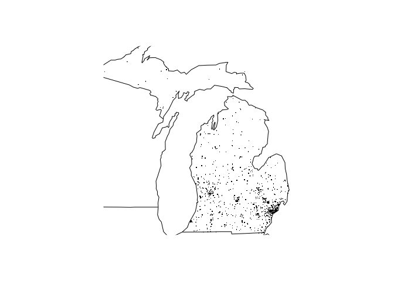

*FarsCoursera is a peer reviewed project to practice R package Building*

<!-- badges: start -->

[](https://github.com/Capucine0210/FarsCoursera/actions/workflows/R-CMD-check.yaml)
<!-- badges: end -->

**NB: Travis badge is now deprecated and replace by the badge above**

This packages provides functions to **process** and **plot** data from
the US National Highway Traffic Safety Administration’s [Fatality
Analysis Reporting
System](https://www.nhtsa.gov/research-data/fatality-analysis-reporting-system-fars).

-   Process data with `fars_summarize_years()`

-   Visualize data with `fars_map_state()`

Those functions **require** that current working directory contains FARS
data from the given year named like **accident\_\[year\].csv.bz2**

## The data

The packages has 3 files relating the FARS data from 2013 to 2015.

They are accessible under the folder accessible by running the following
line.

``` r
system.file("extdata", package = "FarsCoursera") %>% 
  list.files()
```

## Summarizing data

Let’s process the accidents data of 2013 by summarizing them by month in
year in a tibble using the `fars_summarize_years()` function.

``` r
fars_2013 <- fars_summarize_years(2013)
fars_2013
#> # A tibble: 12 × 2
#>    MONTH `2013`
#>    <dbl>  <int>
#>  1     1   2230
#>  2     2   1952
#>  3     3   2356
#>  4     4   2300
#>  5     5   2532
#>  6     6   2692
#>  7     7   2660
#>  8     8   2899
#>  9     9   2741
#> 10    10   2768
#> 11    11   2615
#> 12    12   2457
```

Nota Bene `fars_summarize_years()` can also create a summary report for
multiple years.

``` r
fars_2013_2014 <- fars_summarize_years(c(2013, 2014))
fars_2013_2014
#> # A tibble: 12 × 3
#>    MONTH `2013` `2014`
#>    <dbl>  <int>  <int>
#>  1     1   2230   2168
#>  2     2   1952   1893
#>  3     3   2356   2245
#>  4     4   2300   2308
#>  5     5   2532   2596
#>  6     6   2692   2583
#>  7     7   2660   2696
#>  8     8   2899   2800
#>  9     9   2741   2618
#> 10    10   2768   2831
#> 11    11   2615   2714
#> 12    12   2457   2604
```

## Visualizing data

The `fars_map_state` function will plot all accidents locations for a
given year and federal state on a US federal state map.

``` r
fars_map_state(26, 2014)
```

<!-- -->
